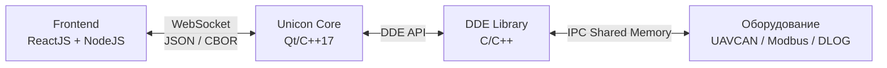
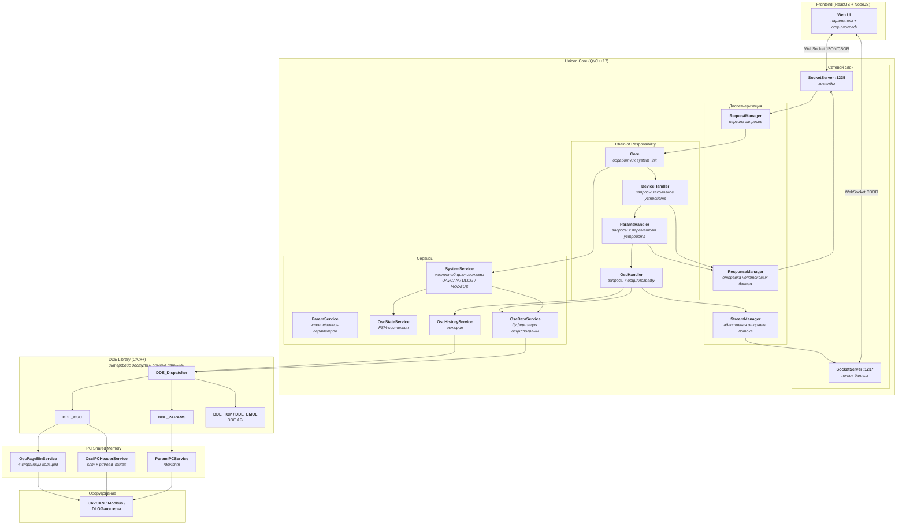

# Unicon

 Программно-аппаратный комплекс для сбора, обработки и визуализации данных промышленного оборудования в режиме реального времени---

## 1. Краткое описание проекта

**Unicon** — состоит из четырёх слоёв:

| Слой | Описание |
|------|----------|
| **Frontend** | Веб-приложение (ReactJS + NodeJS), отображающее параметры оборудования и эмулирующее работу осциллографа. |
| **Unicon Core** | Серверный слой, ядро системы (Qt/C++17), принимающий данные из драйверов, обрабатывающий их и транслирующий на фронт. |
| **DDE-слой** (Device Data Exchange Library) | Библиотека, включающая сервисы (C/C++) для получения данных, осцилограм, потоков данных и пересылки команд через IPC Shared Memory и встроенную БД (SQLight DB). 
| **Слой драйверов** (Device drivers) | Драйверы и низкоуровневые сервисы (C/C++), работающие непосредственно с оборудованием через каналы связи (оптический, MODBUS  и т.д.). |

**Ключевая особенность:** обмен большими объёмами данных (параметры + осциллограммы) в реальном времени с минимальными задержками и отзывчивый интерфейс пользователя за счёт связки:

```
IPC Shared Memory → Qt/C++ → WebSocket + CBOR → React
```

---

## 2. Требования к проекту

### 2.1. Функциональные требования

| № | Требование |
|---|------------|
| **1** | Сбор значений параметров оборудования в потоке с частотой от 1 Гц до ~50 Гц. Поддерживаемые типы значений: int, float, hex32, bin, text, ascii через DDE-слой |
| **2** | Группировка параметров по модулям. Возможность отслеживать изменения всех параметров выбранного модуля |
| **3** | Поддержка одиночных запросов значений и потоковой передачи (streaming) |
| **4** | Управление частотой потоковой передачи (от 1 Гц до ~50 Гц) |
| **5** | Чтение/запись параметров как с одного модуля так и с разных модулей одного устройства |
| **6** | Чтение/запись параметров одновременно с разных устройств одного типа системы |
| **7** | Сбор осциллограмм (аналоговые - 16 каналов, дискретные каналы - 128 каналов) с разрешением до микросекунд в режиме реального времени|
| **8** | История осциллограмм: загрузка, сохранение, стриминг сохраненных данных  |
| **9** | Поддержка нескольких типов систем: UAVCAN, DLOG_CPLOT, DLOG_ISTART, MODBUS, FILE_IO (демо) и возможность расширения (добавление новых типов) |
| **10** | Хранение и доступ к описанию, заголовкам устройств, параметров и каналов осциллографа в БД (SQLite) |
| **11** | Мониторинг подключённых устройств (device links) и hot-plug |
| **12** | Определение IP-адреса сервера для подключения фронта |
| **13** | Доступ по основной и резервной VPN-сети (10.8.0.0/24, 10.9.0.0/24) |
| **14** | Автоматическое сохранение осциллограмм на USB-носитель |
| **15** | REST API для подключения внешних систем контроля |

### 2.2. Нефункциональные требования

| № | Требование |
|---|------------|
| **1** | **Производительность:** потоковая передача до 10 000 000 точек на буфер осциллограммы (по формуле 500 000 значений на 16 каналов + дискретные каналы) |
| **2** | **Реальное время:** задержка «оборудование → фронт» в пределах десятков миллисекунд |
| **3** | **Пропускная способность:** адаптивная регулировка задержки отправки в зависимости от скорости сети (ping/pong). Поддержка медленных vpn-сетей (от 10 кб/с) |
| **4** | **Надёжность:** устойчивость к переполнению очередей, обрывам соединений, зависанию нижнего слоя и т.п. |
| **5** | **Кроссплатформенность:** Linux-Debian (основная) на Raspberri PI 3/4/5, Windows (демо-режим FILE_IO) |
| **6** | **Масштабируемость:** до 32 устройств на шину + мастер-устройство |
| **7** | **Модульность:** паттерн «Chain of Responsibility» для обработки запросов |
| **8** | **Потокобезопасность:** защита от гонки данных в IPC и внутренних буферов |
| **9** | **Оптимизация трафика:** CBOR-кодирование для больших пакетов (порог от 10 КБ) |
| **10** | **Логирование и диагностика:** счётчики ошибок, предупреждения об устаревших данных, переполнении буферов |
| **11** | Защита от несанкционированного доступа (автоматическое отключение от vpn сети после автозапуска через 10 мин) |
| **12** | Автоматический запуск системы мониторинга и сбора данных после перезагрузки ОС |


---

## 3. Архитектура

### 3.1. Общая схема

#### Упрощённая схема (4 слоя)



#### Детальная схема



### 3.2. Ключевые архитектурные решения

#### Chain of Responsibility для обработки запросов

Все входящие JSON-запросы проходят через цепочку обработчиков:

```
Core → DeviceHandler → ParamsHandler → OscHandler
```

Каждый обработчик реализует `canHandle()` — проверяет `sys_type_id` и `request_id`. Если запрос «его» — обрабатывает, иначе передаёт следующему. Это позволяет:

- легко добавлять новые команды без изменения существующих классов;
- изолировать логику по доменам (устройства / параметры / осциллограммы);
- поддерживать несколько SystemService (по одному на тип системы) одновременно.

#### Два независимых WebSocket-сервера

| Порт | Назначение |
|------|------------|
| **1235** | Команды и ответы (через RequestManager + ResponseManager) |
| **1237** | Потоковые данные (через StreamManager) |

Разделение позволяет потоку данных не блокировать обработку команд и наоборот.

#### StreamManager с адаптивной задержкой

Отдельный рабочий поток (`StreamWorker`) разгружает очередь `QQueue<QJsonObject>` и отправляет данные. Скорость сети измеряется через WebSocket `ping/pong`, задержка между отправками адаптируется:

```
Fast   (ping ≤ 100 мс)  → коэф. 100000
Medium (100–1000 мс)    → коэф. 1000
Slow   (> 1000 мс)      → коэф. 500
```

Задержка увеличивается на 10 % при неудачной отправке и уменьшается на 10 % при успешной — самонастраивающийся механизм против переполнения TCP-буфера.

#### Двойное кодирование JSON ↔ CBOR

В `ResponseManager::send()`:

- если сериализованный JSON < 10 000 байт → отправляется текстом;
- иначе → конвертируется в CBOR и отправляется бинарным сообщением.

Экономия трафика на больших пакетах осциллограмм без потери читаемости мелких.

#### IPC Shared Memory в DDE-слое

Обмен с оборудованием идёт не через сокеты, а через разделяемую память (`shm_open` + `mmap`):

| Сервис | Назначение |
|--------|------------|
| **ParamIPCService** | Параметры и команды (`DEVICE_ELEMENTS`, `DEVICE_COMMANDS`) |
| **OscIPCHeaderService** | Заголовки осциллограмм (`GLIO_OSC_HEADER`) |
| **OscPageBinService** | Постраничная передача данных осциллограмм через `/dev/shm` (4 страницы по кольцу) |

Позволяет передавать большие объёмы (до `OSC_DATA_BUFFER_SIZE = 65536` точек на канал) за один раз с минимальными задержками.

#### Конечный автомат для сбора осциллограмм

`OscStateMachine` реализует FSM со состояниями:

```
Normal → Idle → Getting → Busy → Saving → Updated → Finished / Error
```

Обеспечивает:

- устойчивость к временной недоступности данных (`Busy` — повторные попытки);
- автоматическое сохранение на USB при достижении `eof` + `sof`;
- счётчик ошибок с переходом в `Finished` после 10 неудач;
- автоматическую переинициализацию при обновлении заголовка (`header_updated`).

### 3.3. Структура модулей

| Модуль | Назначение |
|--------|------------|
| **Core** | Точка входа, инициализация DDE, инициализация по типу системы (chain-обработчик `system_init`) |
| **SystemService** | Управление жизненным циклом одного типа системы (UAVCAN / DLOG / MODBUS / FILE_IO), мониторинг device links |
| **RequestManager** | Синглтон, последовательная обработка входящих запросов через chain, парсинг JSON |
| **ResponseManager** | Синглтон, рассылка ответов всем WebSocket-клиентам, JSON/CBOR |
| **StreamManager** | Стриминг данных в отдельном потоке, адаптивная задержка, ping/pong |
| **SocketServer** | WebSocket-сервер, определение IP  |
| **DeviceHandler** | Запросы заголовков устройств, модулей, статуса системы, links |
| **ParamsHandler** | Чтение/запись параметров, открытие/закрытие потоков параметров |
| **OscHandler** | Заголовки, каналы, поток осциллограмм, история |
| **OscDataService** | Буферизация осциллограмм, конвертация, сериализация |
| **OscHistoryService** | Загрузка истории с диска по дате и шагу |
| **OscStateService** | Управление FSM-состояниями осциллографа по каждому устройству |
| **OscDataLogger** | Сохранение/загрузка осциллограмм (JSON + CBOR) |
| **DataUsbCopier** | Мониторинг USB и копирование сохранённых данных |
| **DDE_Dispatcher** | Реестр DDE-провайдеров по типу системы |

---

## 4. Технологический стек

| Компонент | Технология |
|-----------|------------|
| **Язык** | C++17 |
| **Фреймворк** | Qt 5/6 (Core, Network, WebSockets, Concurrent) |
| **Сериализация** | QJsonObject, QCbor |
| **Многопоточность** | QThread, QMutex, QWaitCondition, QtConcurrent |
| **IPC** | POSIX Shared Memory (`shm_open`, `mmap`), `pthread_mutex` |
| **Сборка** | qmake (`.pro`), статические библиотеки |
| **Целевые ОС** | Linux-Debian (основная), Windows (демо) |
| **Frontend** (внешний) | ReactJS + NodeJS |

---

> **Лицензия:** Проект для внутреннего использования. Автор проекта и разработчик Александр Швабский (@ashvabsky).
